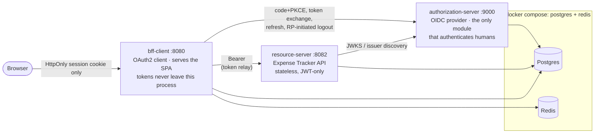

# Spring Security 7 Reference Application — Expense Tracker

[](https://github.com/dsouzamelroy2007/spring-security-oauth-jwt/actions/workflows/ci.yml)

A multi-module Spring Boot reference application demonstrating Spring Security 7:
OAuth2, OpenID Connect and JWT, with a small Expense Tracker REST API as the
business domain.

*Personal portfolio project. Not affiliated with or endorsed by any employer.*

**Status:** All five milestones complete. `authorization-server` is a full OIDC
provider, `resource-server` is the Expense Tracker API with a table-driven
authorization matrix, `bff-client` serves the SPA and holds tokens server-side,
and `integration-tests` proves a genuine code+PKCE grant end to end across two
real, independently-running processes.

## Architecture



`shared-security` (not pictured -- it's a library, not a process) supplies RFC
9457 error handling, the JWT-claims-to-authorities converter, audit event
writing, and org-context resolution to every module above that needs them.

| Module | Role |
|---|---|
| `shared-security` | Library. Reusable auto-configuration: RFC 9457 errors, JWT converters, audit, org resolution. No Boot repackaging. |
| `authorization-server` | OIDC Provider. The only module that authenticates humans. |
| `resource-server` | The Expense Tracker API. The main showcase. |
| `bff-client` | Server-side OAuth2 client. Holds tokens in a Redis session, serves the static SPA, exposes only an HttpOnly cookie to the browser. |
| `integration-tests` | Cross-module black-box tests. |

## Prerequisites

- Java 21
- Maven 3.9+
- Docker (for Postgres and Redis)

## Quick start

```bash
make up      # postgres + redis, then builds and launches all three apps
make test    # full build + test suite (unit, slice, cross-module IT)
make down    # stops the apps and the containers
```

`make up` is the one-command run: it waits for Postgres and Redis to be
healthy, builds the three application jars, launches them as local
background processes (not containers -- see
[`docs/decisions/0014-no-containerized-app-images.md`](docs/decisions/0014-no-containerized-app-images.md)
for why), and polls each one's `/actuator/health` before returning. Logs land
in `.run/*.log`.

```bash
mvn -q validate                             # cheapest check; run after ANY pom edit
mvn -q -DskipTests dependency:go-offline    # resolves every coordinate, all modules
mvn -q -pl <module> -am test                # unit + slice tests for one module
mvn -q verify                               # full build incl. failsafe IT tests
```

## Try it

Once `make up` finishes:

```bash
# Public endpoint, no token needed
curl http://localhost:8082/api/v1/categories

# Open the SPA in a browser -- login, list/submit/approve reports, logout
open http://localhost:8080/

# client_credentials, end to end (no browser, no cookies)
curl -u export-worker:export-worker-secret \
     -d grant_type=client_credentials -d scope=expenses.export \
     http://localhost:9000/oauth2/token
```

See `demo.http` (repo root) and `bruno/expense-tracker/` for the full request
collection covering every endpoint style in the authorization matrix, and
`docs/flows/*.md` for a Mermaid sequence diagram of each OAuth2/OIDC flow:

- [`docs/flows/code-pkce-via-bff.md`](docs/flows/code-pkce-via-bff.md) — the SPA's real login path
- [`docs/flows/client-credentials.md`](docs/flows/client-credentials.md) — M2M, no browser
- [`docs/flows/refresh-rotation.md`](docs/flows/refresh-rotation.md) — access-token renewal
- [`docs/flows/rp-initiated-logout.md`](docs/flows/rp-initiated-logout.md) — logout at both ends
- [`docs/flows/filter-chain-ordering.md`](docs/flows/filter-chain-ordering.md) — how each module's `SecurityFilterChain` beans are ordered

## Concept → file

Generated by grepping every `[FEATURE xN]` marker comment in the codebase
(`grep -rn "\[FEATURE " --include="*.java" . | grep -v /target/`), then
grouped by feature ID. Re-run that command to regenerate; this table is not a
maintained build artifact, just a snapshot taken at M5.

### A. Authentication mechanisms

| # | Feature | Primary files |
|---|---|---|
| A1 | Form login, custom success/failure handlers | [`authorization-server/.../web/LoginController.java`](authorization-server/src/main/java/com/mel/expensetracker/authserver/web/LoginController.java), [`FormLoginSuccessHandler.java`](authorization-server/src/main/java/com/mel/expensetracker/authserver/web/FormLoginSuccessHandler.java), [`FormLoginFailureHandler.java`](authorization-server/src/main/java/com/mel/expensetracker/authserver/web/FormLoginFailureHandler.java) |
| A2 | HTTP Basic on a separate filter chain | [`bff-client/.../config/BasicAuthSecurityConfig.java`](bff-client/src/main/java/com/mel/expensetracker/bff/config/BasicAuthSecurityConfig.java) |
| A3 | JPA `UserDetailsService` + in-memory comparison | [`authorization-server/.../user/JpaUserDetailsService.java`](authorization-server/src/main/java/com/mel/expensetracker/authserver/user/JpaUserDetailsService.java), [`FormLoginSecurityConfig.java`](authorization-server/src/main/java/com/mel/expensetracker/authserver/config/FormLoginSecurityConfig.java) |
| A4 | `DelegatingPasswordEncoder`, bcrypt→argon2 upgrade-on-login | [`authorization-server/.../config/PasswordEncoderConfig.java`](authorization-server/src/main/java/com/mel/expensetracker/authserver/config/PasswordEncoderConfig.java) |
| A5 | Pre-authenticated API-key filter (`addFilterBefore`) | [`bff-client/.../security/ApiKeyAuthenticationFilter.java`](bff-client/src/main/java/com/mel/expensetracker/bff/security/ApiKeyAuthenticationFilter.java), [`ApiKeySecurityConfig.java`](bff-client/src/main/java/com/mel/expensetracker/bff/config/ApiKeySecurityConfig.java) |

### B. OAuth2 + OIDC

| # | Feature | Primary files |
|---|---|---|
| B1 | Authorization Code + PKCE via the BFF | [`bff-client/.../config/BffSecurityConfig.java`](bff-client/src/main/java/com/mel/expensetracker/bff/config/BffSecurityConfig.java), [`RelayClientConfig.java`](bff-client/src/main/java/com/mel/expensetracker/bff/config/RelayClientConfig.java), [`ResourceServerClient.java`](bff-client/src/main/java/com/mel/expensetracker/bff/relay/ResourceServerClient.java) |
| B2 | `client_credentials` for the export endpoint | [`resource-server/.../export/ReportExportController.java`](resource-server/src/main/java/com/mel/expensetracker/resourceserver/export/ReportExportController.java), [`RegisteredClientSeeder.exportWorker()`](authorization-server/src/main/java/com/mel/expensetracker/authserver/client/RegisteredClientSeeder.java) |
| B3 | Refresh token rotation | [`bff-client/.../config/RelayClientConfig.java`](bff-client/src/main/java/com/mel/expensetracker/bff/config/RelayClientConfig.java), `RegisteredClientSeeder.bffClient()`'s `reuseRefreshTokens(false)` |
| B4 | OIDC RP-initiated logout | [`bff-client/.../config/BffSecurityConfig.java`](bff-client/src/main/java/com/mel/expensetracker/bff/config/BffSecurityConfig.java), `RegisteredClientSeeder.bffClient()`'s `postLogoutRedirectUri` |
| B5 | RSA signing with key rotation | [`authorization-server/.../config/jwk/JwkSourceConfig.java`](authorization-server/src/main/java/com/mel/expensetracker/authserver/config/jwk/JwkSourceConfig.java), [`RotatingRsaKeyManager.java`](authorization-server/src/main/java/com/mel/expensetracker/authserver/config/jwk/RotatingRsaKeyManager.java), [`RsaKeyRotationScheduler.java`](authorization-server/src/main/java/com/mel/expensetracker/authserver/config/jwk/RsaKeyRotationScheduler.java) |
| B6 | Custom `OAuth2TokenCustomizer` (org + role claims) | [`authorization-server/.../config/token/OrgRoleClaimsTokenCustomizer.java`](authorization-server/src/main/java/com/mel/expensetracker/authserver/config/token/OrgRoleClaimsTokenCustomizer.java) |
| B7 | `JwtAuthenticationConverter` (scope + claims → authorities) | [`shared-security/.../jwt/RoleAndScopeAuthoritiesConverter.java`](shared-security/src/main/java/com/mel/expensetracker/shared/jwt/RoleAndScopeAuthoritiesConverter.java), [`JwtAuthenticationConverterAutoConfiguration.java`](shared-security/src/main/java/com/mel/expensetracker/shared/jwt/JwtAuthenticationConverterAutoConfiguration.java) |
| B8 | `JwtDecoder` (issuer, audience, timestamp, custom validator) | [`resource-server/.../config/JwtDecoderConfig.java`](resource-server/src/main/java/com/mel/expensetracker/resourceserver/config/JwtDecoderConfig.java), [`RequiredClaimShapeValidator.java`](resource-server/src/main/java/com/mel/expensetracker/resourceserver/config/RequiredClaimShapeValidator.java) |
| B9 | Registered clients persisted in JDBC | [`authorization-server/.../config/AuthorizationServerConfig.java`](authorization-server/src/main/java/com/mel/expensetracker/authserver/config/AuthorizationServerConfig.java), [`RegisteredClientSeeder.java`](authorization-server/src/main/java/com/mel/expensetracker/authserver/client/RegisteredClientSeeder.java) |
| B10 | Consent screen (per-client scopes and TTLs) | [`authorization-server/.../web/ConsentController.java`](authorization-server/src/main/java/com/mel/expensetracker/authserver/web/ConsentController.java) |

### C. Authorization

| # | Feature | Primary files |
|---|---|---|
| C1 | Role vs authority vs scope | [`resource-server/.../report/ExpenseReportController.java`](resource-server/src/main/java/com/mel/expensetracker/resourceserver/report/ExpenseReportController.java), [`RoleAndScopeAuthoritiesConverter.java`](shared-security/src/main/java/com/mel/expensetracker/shared/jwt/RoleAndScopeAuthoritiesConverter.java) |
| C2 | Role hierarchy (`ORG_ADMIN` > `FINANCE` > `MANAGER` > `EMPLOYEE`) | [`resource-server/.../config/MethodSecurityConfig.java`](resource-server/src/main/java/com/mel/expensetracker/resourceserver/config/MethodSecurityConfig.java) |
| C3 | Method security (`@PreAuthorize`/`@PostFilter`/etc.) + `@IsOrgAdmin` | [`MethodSecurityConfig.java`](resource-server/src/main/java/com/mel/expensetracker/resourceserver/config/MethodSecurityConfig.java), [`shared-security/.../authz/IsOrgAdmin.java`](shared-security/src/main/java/com/mel/expensetracker/shared/authz/IsOrgAdmin.java), [`ExpenseReportService.java`](resource-server/src/main/java/com/mel/expensetracker/resourceserver/report/ExpenseReportService.java) |
| C4 | Custom `AuthorizationManager` (org-tenancy, ownership) | [`resource-server/.../report/ReportAccessAuthorizationManager.java`](resource-server/src/main/java/com/mel/expensetracker/resourceserver/report/ReportAccessAuthorizationManager.java) |
| C5 | Field-level IBAN redaction | [`resource-server/.../reimbursement/IbanMasker.java`](resource-server/src/main/java/com/mel/expensetracker/resourceserver/reimbursement/IbanMasker.java), [`ReimbursementMapper.java`](resource-server/src/main/java/com/mel/expensetracker/resourceserver/reimbursement/ReimbursementMapper.java) |

### D. Web hardening / plumbing

| # | Feature | Primary files |
|---|---|---|
| D1 | CORS with working preflight | [`bff-client/.../config/CorsConfig.java`](bff-client/src/main/java/com/mel/expensetracker/bff/config/CorsConfig.java) |
| D2 | CSRF: SPA-friendly on the BFF, disabled + justified on the JWT chain | [`resource-server/.../config/SecurityConfig.java`](resource-server/src/main/java/com/mel/expensetracker/resourceserver/config/SecurityConfig.java), [`bff-client/.../config/BffSecurityConfig.java`](bff-client/src/main/java/com/mel/expensetracker/bff/config/BffSecurityConfig.java), [`SpaCsrfTokenRequestHandler.java`](bff-client/src/main/java/com/mel/expensetracker/bff/security/SpaCsrfTokenRequestHandler.java) |
| D3 | Security headers (CSP, HSTS, referrer policy) | [`bff-client/.../config/BffSecurityConfig.java`](bff-client/src/main/java/com/mel/expensetracker/bff/config/BffSecurityConfig.java) |
| D4 | Session management (fixation, concurrency, Redis-backed) | [`BffSecurityConfig.java`](bff-client/src/main/java/com/mel/expensetracker/bff/config/BffSecurityConfig.java), [`SessionConfig.java`](bff-client/src/main/java/com/mel/expensetracker/bff/config/SessionConfig.java) |
| D5 | Multiple ordered `SecurityFilterChain` beans + diagram | [`docs/flows/filter-chain-ordering.md`](docs/flows/filter-chain-ordering.md) (all seven chain-declaring files) |
| D6 | RFC 9457 `AuthenticationEntryPoint` / `AccessDeniedHandler` | [`shared-security/.../error/ProblemDetailAccessDeniedHandler.java`](shared-security/src/main/java/com/mel/expensetracker/shared/error/ProblemDetailAccessDeniedHandler.java), [`ProblemDetailAuthenticationEntryPoint.java`](shared-security/src/main/java/com/mel/expensetracker/shared/error/ProblemDetailAuthenticationEntryPoint.java) |
| D7 | Actuator on a separate port and chain | [`bff-client/.../config/ActuatorSecurityConfig.java`](bff-client/src/main/java/com/mel/expensetracker/bff/config/ActuatorSecurityConfig.java) |
| D8 | Security audit events (structured logs + table) | [`shared-security/.../audit/AuditEventWriter.java`](shared-security/src/main/java/com/mel/expensetracker/shared/audit/AuditEventWriter.java), [`AuditEvent.java`](shared-security/src/main/java/com/mel/expensetracker/shared/audit/AuditEvent.java) |
| D9 | `SecurityContext` across `@Async`/virtual threads | Cut for time — see [`docs/decisions/0013-no-async-security-context-propagation.md`](docs/decisions/0013-no-async-security-context-propagation.md) |

## Out of scope

Each cut below is a considered decision, not a dropped TODO — every row links
an ADR explaining the reasoning.

| Cut | Reason | ADR |
|---|---|---|
| Social login / IdP federation | Needs real, obtainable OAuth app credentials — breaks offline-from-fresh-clone and CI. | [0004](docs/decisions/0004-no-social-login-idp-federation.md) |
| Passkeys / WebAuthn | Needs HTTPS and a physical authenticator to demo; no automated-test story. | [0005](docs/decisions/0005-no-passkeys-webauthn.md) |
| Domain object security with ACLs | `[FEATURE C4]`'s custom `AuthorizationManager` proves the same skill for a fraction of the schema cost. | [0006](docs/decisions/0006-no-acls.md) |
| Dynamic Client Registration | Niche; `[FEATURE B9]` already proves JDBC client persistence. | [0007](docs/decisions/0007-no-dynamic-client-registration.md) |
| RFC 8693 token exchange | Only meaningful with a third service hop that doesn't exist in this topology. | [0008](docs/decisions/0008-no-token-exchange-rfc8693.md) |
| TOTP / step-up authentication | Second-factor plumbing for a bullet `[FEATURE C4]` already covers a more interesting version of. | [0009](docs/decisions/0009-no-totp-step-up.md) |
| Opaque tokens + introspection | Replaced by an ADR on the JWT-vs-opaque tradeoff. | [0002](docs/decisions/0002-jwt-vs-opaque-tokens.md) |
| Rate limiting / brute-force lockout | Not a Spring Security concept; real production hardening, out of this repo's teaching scope. | [0010](docs/decisions/0010-no-rate-limiting.md) |
| One-Time-Token magic link, remember-me, custom `AuthenticationProvider` | Each a half-day for a bullet A1–A5 already cover the `AuthenticationManager` story for. | [0011](docs/decisions/0011-no-ott-remember-me-custom-authprovider.md) |
| `service-worker` module | A whole module for one grant type already proven by `[FEATURE B2]` and `demo.http`. | [0012](docs/decisions/0012-no-service-worker-module.md) |
| D9 — async `SecurityContext` propagation | Cut for time; MILESTONES.md's own named stretch goal. | [0013](docs/decisions/0013-no-async-security-context-propagation.md) |
| Containerized app images | Issuer/discovery addressing needs a real host/container/browser story; `make up` runs local JVM processes instead. | [0014](docs/decisions/0014-no-containerized-app-images.md) |

See [`docs/decisions/`](docs/decisions/) for the full list, including the
three core architectural decisions (`0001`–`0003`).

## License

MIT — see [LICENSE](LICENSE).
