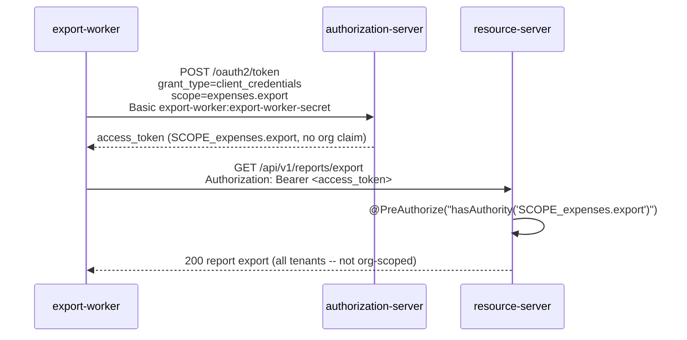

# Client Credentials (M2M)

`[FEATURE B2]` No end user, no browser, no redirect. A worker process
authenticates as itself and calls the API directly.

The access token carries no `org` claim: `OrgRoleClaimsTokenCustomizer` only
stamps `org`/`roles` when the token's principal is an `AppUserPrincipal`
(a human), which client_credentials never has. The export endpoint is
deliberately the one place in the API that is *not* tenant-scoped -- an
export job runs across every organisation by design.

Related: `docs/decisions/0003-no-password-grant.md`.
