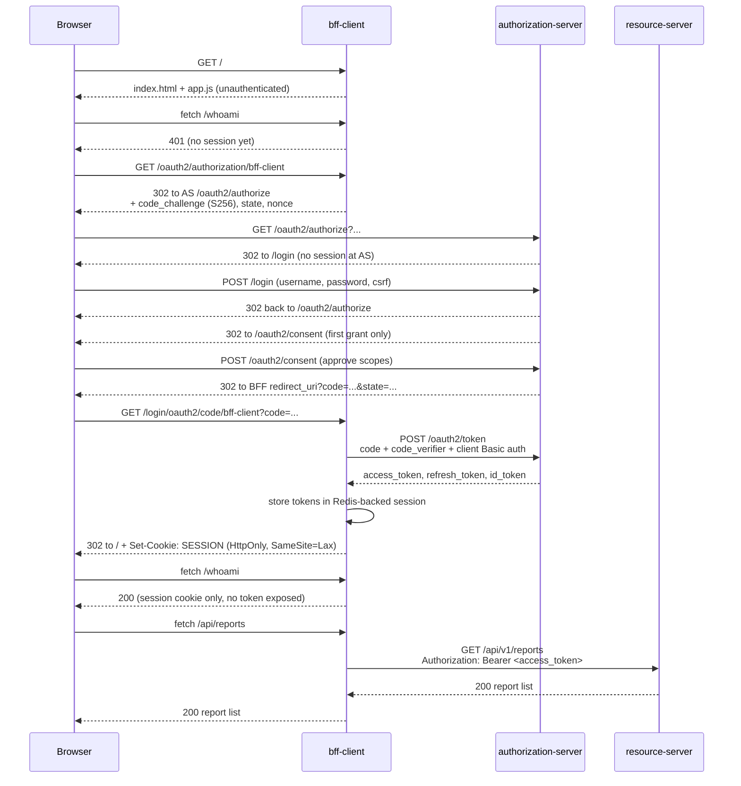

# Authorization Code + PKCE, via the BFF

`[FEATURE B1]` The browser never sees a token. `bff-client` runs the entire
OAuth2 dance server-side and hands the browser only an `HttpOnly` session
cookie.

Related: `docs/decisions/0001-why-bff.md`, `docs/flows/refresh-rotation.md`,
`docs/flows/rp-initiated-logout.md`.
