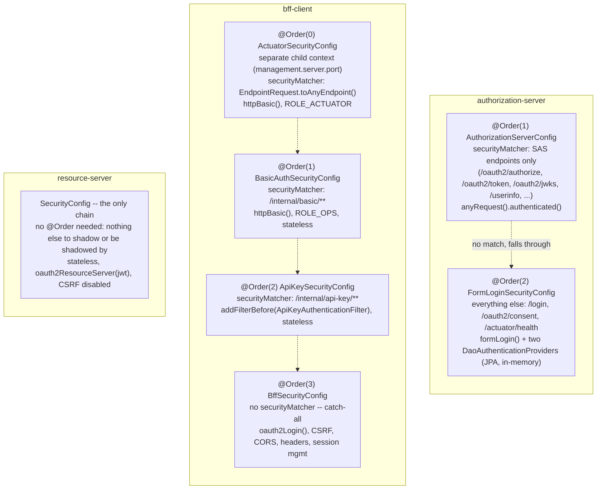

# Security Filter Chain Ordering

`[FEATURE D5]` Every module but `resource-server` needs more than one
`SecurityFilterChain` bean, because different URL spaces in the same app need
fundamentally different treatment (JWT bearer vs. session vs. Basic vs.
API-key). Spring Security tries chains in ascending `@Order`, first match on
`securityMatcher` wins -- so the narrowest chains must come first, or a
broader catch-all further down would shadow them.

Two contexts, one chain list: `bff-client`'s management child context and its
main application context are resolved *ancestor-inclusively* by Spring
Security's `WebSecurityConfiguration` -- `ActuatorSecurityConfig`'s chain in
the child context is still visible from, and can shadow or be shadowed by,
the three chains declared in the parent. `@Order(0)` keeps it ahead of
`BffSecurityConfig`'s any-request catch-all regardless of which context
"wins" visibility.

Related: `docs/decisions/0001-why-bff.md`.
