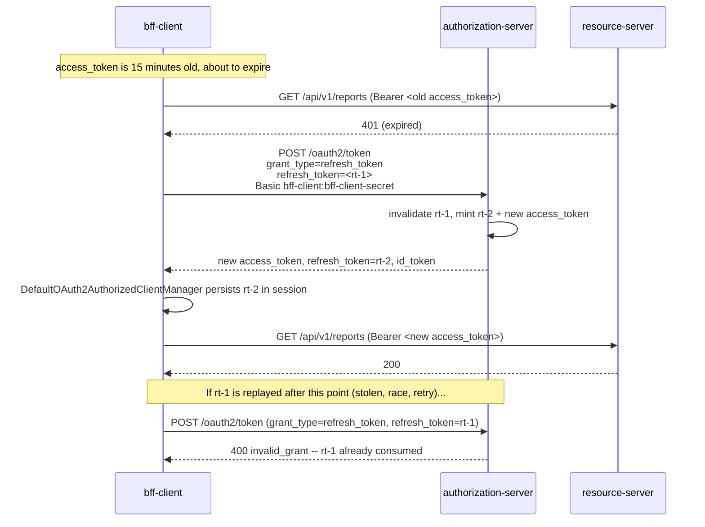

# Refresh Token Rotation

`[FEATURE B3]` `bff-client`'s registered client has `reuseRefreshTokens(false)`
(`RegisteredClientSeeder.bffClient()`) -- every refresh grant invalidates the
refresh token it consumed and issues a brand new one. A stolen, already-used
refresh token is worthless to an attacker the moment the legitimate client
refreshes first.

The rotation itself is Boot's stock `DefaultOAuth2AuthorizedClientManager` --
no bespoke refresh code in this repo. The revoked/replayed rejection is
proven end to end by `integration-tests`' `CodeGrantEndToEndIT` against a
real, running authorization-server.

Related: `docs/flows/code-pkce-via-bff.md`.
