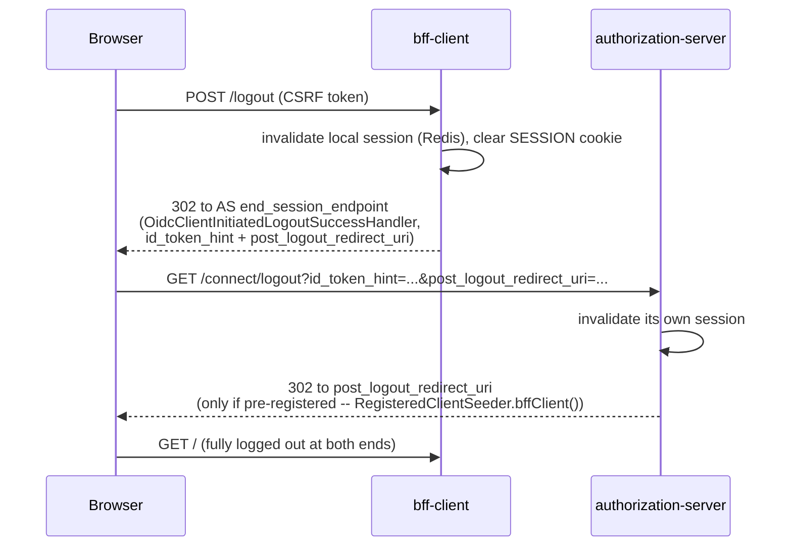

# RP-Initiated Logout

`[FEATURE B4]` Logging out of the SPA also ends the session at
authorization-server -- not just at `bff-client`. Without this, a browser
that still holds an authorization-server session cookie could silently
re-authenticate without a login prompt on the very next `/oauth2/authorize`
redirect.

An unregistered `post_logout_redirect_uri` is silently ignored by Spring
Authorization Server, not rejected with an error -- `RegisteredClientSeeder`
registers `http://127.0.0.1:8080/` explicitly for exactly this reason.

Related: `docs/flows/code-pkce-via-bff.md`.
